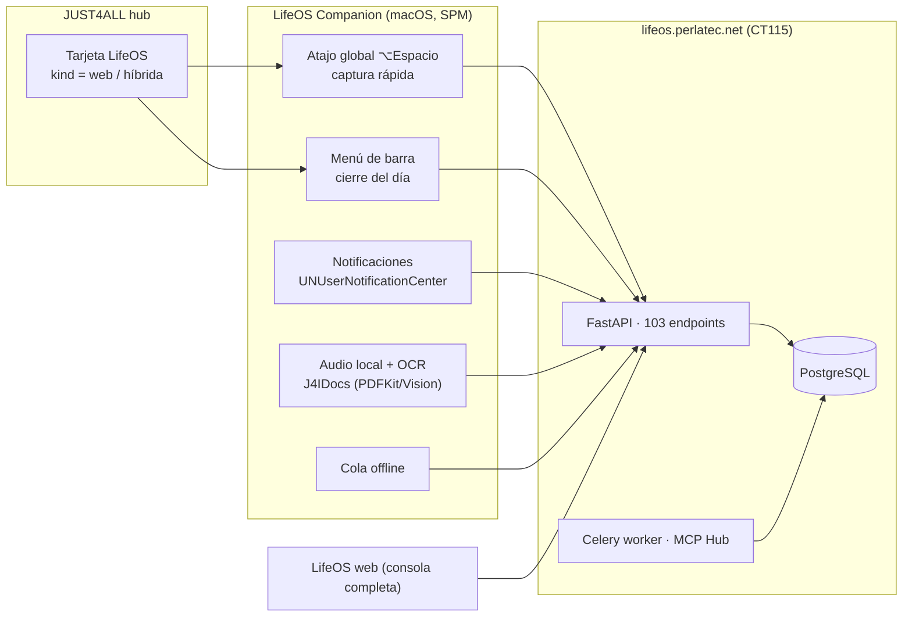

# Propuesta — LifeOS como subapp de JUST4ALL (versión macOS)

- **Fecha**: 30-sep-2026
- **Estado**: **superado por la decisión del owner** — se conserva como justificación del alcance.
  El plan vigente es [`PLAN_LIFEOS_MACOS_API.md`](PLAN_LIFEOS_MACOS_API.md).
- **Base**: revisión directa del repo `LifeOS` (en `../0_server_dorticos/LifeOS`) y del contrato de subapp de este repo.

> **Decisión del owner (30-sep-2026)**: se quiere un cliente **nativo que consuma la API** de LifeOS, no un
> shell web ni una PWA. El plan ejecutable está en [`PLAN_LIFEOS_MACOS_API.md`](PLAN_LIFEOS_MACOS_API.md);
> este documento queda como el análisis que fija el **alcance** (por qué *no* se clona la web completa).

---

## 1. Veredicto

**Sí a LifeOS en el Mac. No a un clon nativo del LifeOS web.** (Un cliente nativo *de alcance acotado* sobre la
API sí es la vía correcta — ver el plan vigente.)

La vía correcta es un **LifeOS Companion para macOS**: cliente nativo *fino*, centrado en el ciclo diario
(capturar → confirmar → hoy → diario) más lo que sólo el escritorio puede hacer (atajo global, menú de barra,
notificaciones reales con la app cerrada, audio y OCR locales, cola offline). La **web sigue siendo la consola
completa** (12 secciones, conectores, objetivos, métricas, conocimiento, ajustes).

Y el orden importa: **primero lo barato** (PWA de verdad + tarjeta en el hub, ~3 días de trabajo) y **después**
decidir lo caro, porque el propio LifeOS tiene su roadmap **cerrado a ampliaciones** hasta terminar la validación
personal (Fase 5: «No se ampliará alcance durante las seis semanas»; Fase 6 sitúa los clientes nativos *detrás* de
esa validación).

---

## 2. Qué es LifeOS hoy (evidencia verificada en el repo)

| Dimensión | Realidad medida |
|---|---|
| Producto | Organizador personal inteligente: captura universal, agenda, diario, objetivos, métricas, conocimiento, conectores |
| Web | Next.js **16.3** + React **19.2** + TS 5.8 · **7.155 LOC** en `web/app`, `web/components`, `web/lib` |
| Web — concentración | `web/app/page.tsx` = **4.674 LOC** (monolito con las vistas; `AgendaView`, `MapView`, `ReviewView`…) |
| API | FastAPI 0.115 + SQLAlchemy 2 + Alembic · **7.558 LOC** en `api/app` |
| API — concentración | `api/app/main.py` = **4.067 LOC** |
| Superficie de contrato | **103 endpoints** (41 GET, 45 POST, 12 PATCH, 5 DELETE) y **100 clases** Pydantic en `api/app/schemas.py` |
| Persistencia | PostgreSQL (fuente canónica) + **23 migraciones** Alembic (`0023_sync_origin` es la cabeza) |
| Asíncrono | Redis + Celery worker (indexación, transcripción) |
| IA | MCP Hub externo (CT111), cadena `deepseek → openai → huggingface → gemini`; `deepseek-v4-flash` principal |
| Auth | Argon2id, sesión opaca con **cookie HttpOnly** revocable, TOTP opcional, autorización por workspace |
| Despliegue | Self-hosted: CT115 (LifeOS) + CT107 (PostgreSQL) + CT111 (MCP Hub) + NPM (CT103) → `https://lifeos.perlatec.net` |
| PWA | **Ya existe**: `web/app/manifest.ts` con `display: standalone`, temas `#101421` / `#5e5bd8` e iconos 192/512 |
| Sistema de diseño | Tokens en JSON (`design-system/tokens/{primitives,semantic,light,dark}.json`) + `web/app/globals.css` (573 LOC) |
| Calidad | 180/180 pytest · 54/54 Playwright · auditoría visual 12 secciones × 3 perfiles |

**Hueco declarado por el propio producto** (README de LifeOS): los avisos «se entregan como notificación del
sistema **mientras LifeOS está abierto** … Sin servidor de push, con LifeOS cerrado no pueden sonar, y la interfaz
lo dice así». Es exactamente el hueco que cierra una app nativa.

También hay una lección previa registrada: para transcripción local se probó Whisper **small + int8** y la
decisión acordada fue descartarlo si la latencia no era suficientemente buena (depende del hardware; hoy es
viable, pero hay que medirlo antes de prometerlo).

---

## 3. Qué es una subapp de JUST4ALL hoy (el contrato a cumplir)

1. **Carpeta propia** `APPS/<NAME>` con `Package.swift` (SPM), sin `.xcodeproj` propio.
2. **Catálogo hardcodeado** en `Sources/JUST4ALL/SubAppModel.swift` (`SubAppsCatalog.items`).
3. **Detección de instalación por `bundleId`** (`NSWorkspace.urlForApplication(withBundleIdentifier:)`) y
   lanzamiento con `NSWorkspace.openApplication`.
4. **Distribución obligatoria por DMG**: `ReleaseStore` sólo publica una app si en el release de GitHub existen
   `<PREFIX>-<semver>.dmg` **y** `SHA256SUMS.txt`.
5. **Independencia**: cada subapp funciona sola, sin servidor y sin la app maestra.
6. **Enganches**: `scripts/release.sh`, `scripts/sync_local_dmgs.sh`, `scripts/clean_artifacts.sh`, el workspace
   `JUST4ALL.xcworkspace` y los assets en `Sources/JUST4ALL/Resources/Assets/<PREFIX>/`.
7. **Reuso**: `PACKAGES/J4SHARED` expone librerías (`J4FCore`, `J4FFileSystem`, `J4ICore`, `J4IIndex`).
   Ojo: el atajo global y el panel flotante de JUST4DESK (**G4**) viven en su *target de app*, no en J4SHARED;
   reutilizarlos exige promoverlos. Sí es librería consumible `J4IDocs` (PDFKit + Vision OCR) del paquete
   `JUST4DESK`.

---

## 4. Evaluación de la idea: cinco fricciones estructurales

**F1 — LifeOS es cliente-servidor; JUST4ALL es local-first.**
Ninguna subapp actual necesita servidor. LifeOS sin API es inútil. No es «una app más»: es la primera subapp
**respaldada por servidor** y el hub no sabe expresarlo (ver F4).

**F2 — Duplicar frontend es el coste real, no el Swift.**
Con 103 endpoints y 4.674 LOC en una sola pantalla web, un clon nativo con paridad es un segundo producto:
12 secciones × 2 frontends × mantenimiento infinito. Estimación honesta de paridad nativa completa:
**6–12 meses de una sola persona** y una deuda permanente de divergencia.

**F3 — Choca con el roadmap de LifeOS.**
Fase 5 exige seis semanas **sin ampliar alcance**; Fase 6 aplaza los clientes nativos a después de la validación.
Construir un cliente nativo ahora contradice la estrategia del propio producto.

**F4 — El hub no sabe «lanzar» una app web.**
`SubApp` no tiene noción de tipo de distribución: `isInstalled` se basa en `bundleId` y `ReleaseStore` exige DMG
+ SHA256SUMS. Una LifeOS web encaja mal sin una extensión pequeña y explícita del modelo.

**F5 — Autenticación: no duplicar la superficie.**
La sesión es una cookie HttpOnly pensada para navegador. Un cliente nativo necesita decisión consciente:
compartir cookies (`WKWebsiteDataStore` + `httpCookieStorage`) al principio y, más adelante, un **token de
dispositivo** revocable reutilizando el listado de dispositivos que ya existe en Ajustes.

---

## 5. Opciones comparadas

| Opción | Qué es | Esfuerzo | Riesgo | Veredicto |
|---|---|---|---|---|
| **A. Clon nativo completo (SwiftUI)** | Reescribir las 12 secciones contra la API | 6–12 meses | Altísimo (dos productos que divergen) | **No** |
| **B. Shell nativo (WKWebView + integración)** | Ventana nativa que carga `lifeos.perlatec.net` + atajos, menú de barra, notificaciones, envío de ficheros | 1–2 semanas | Medio (autenticación, offline) | **Sí, como base** |
| **C. Tauri / Electron** | Wrapper multiplataforma | 1–2 semanas | Alto: mete runtime JS/Node en un monorepo Swift y rompe la convención SPM/DMG | **No** |
| **D. Sólo PWA** | «Añadir al Dock» del navegador | **1–2 días** | Bajo | **Sí, ya mismo** |
| **E. Híbrido (recomendado)** | D + B + captura local (audio/OCR/cola offline) y, más adelante, vistas nativas del ciclo diario | 3 días → ~6 semanas por fases | Bajo/medio, incremental y cancelable | **Sí** |

**Criterio de por qué E y no A:** el valor que un Mac añade a LifeOS no es «ver las mismas pantallas con otro
estilo», es **estar siempre a mano** (atajo global, menú de barra, capturar sin abrir nada), **avisar de verdad**
(notificación con la app cerrada), **capturar en local** (audio + OCR sin subir antes de confirmar) y **no perder
capturas** (cola offline). Eso es un *companion*, y es exactamente lo que la web no puede hacer.

---

## 6. Plan por fases

### F0 — Decisión y encaje (0 código · ~1 h)
Cerrar las decisiones de §9 y publicar este documento. **Entregable**: este archivo + línea en
`MODULOS_A_CREAR.MD`.

### F1 — PWA de verdad (1–2 días, sin backend)
Ya hay manifiesto; falta rematarlo: `apple-touch-icon`, iconos maskable correctos, `start_url` con sesión
persistente, comprobación «Añadir al Dock» en Safari y Chrome, y una página corta «LifeOS en tu Mac».
**Valor**: cualquier usuario ya tiene un icono y una ventana propia en el Dock, hoy.
**Criterio de salida**: instalada y abierta como app en macOS, con sesión recordada, sin barra de navegador.

### F2 — Tarjeta en el hub (≈1 día)
Extender el modelo de subapp de forma mínima y explícita:

- `enum SubAppKind { case nativeApp, webApp, hybrid }` (o `distribution`).
- Campo `openURL`/`installURL` opcional y `requirements` honestos («Requiere cuenta y servidor LifeOS»).
- `ReleaseStore` **no** debe exigir DMG+SHA256SUMS para `webApp`.
- `ContentView`: si `kind != .nativeApp`, la acción primaria es «Abrir LifeOS» (`NSWorkspace.open(url)`), no
  «Descargar DMG»; el estado pasa a «Abierta en el navegador / Instalada» según `WKWebsiteDataStore`.

**Valor**: LifeOS aparece en el hub sin fingir que es un DMG.
**Criterio de salida**: tarjeta con logo, descripción, enlaces y botón funcional; el resto de subapps intactas.

### F3 — Shell nativo macOS (1–2 semanas) — `APPS/LIFEOS`
App SPM (`Package.swift`, macOS 14+) con:

- `WKWebView` + `WKWebsiteDataStore` persistente (la sesión del navegador vale), toolbar y menús nativos.
- **Atajo global ⌥Espacio** que abre un panel de captura flotante (patrón **G4** de JUST4DESK, promovido a
  J4SHARED para no copiarlo).
- **Menú de barra** con el cierre del día (`GET /api/v1/day-close`) y «Abrir LifeOS».
- **Notificaciones reales**: `UNUserNotificationCenter` alimentado por `GET /api/v1/reminders/upcoming`; al
  integrarse como app de login o quedar en segundo plano, **cierra el hueco declarado** de «con LifeOS cerrado
  no pueden sonar».
- **Enviar a LifeOS**: `application(_:open:)`, menú Servicios y drag&drop (fichero, texto, selección) → captura.
- URL base configurable (LAN `192.168.100.15` en casa / `lifeos.perlatec.net` fuera) con aviso claro si el
  servidor no responde.

**Anti-alcance**: nada de reimplementar Conectores, Objetivos, Métricas, Conocimiento ni Ajustes.
**Criterio de salida**: la app vive en el Dock, captura con atajo global, avisa con la ventana cerrada y abre la
web en su ventana.

### F4 — Captura local y offline (2–4 semanas, opcional)
- Grabación de audio (`AVFoundation`) + **transcripción local** con Whisper *small + int8* **sólo si la latencia
  medida es aceptable** (lección previa): si no, se delega al worker del servidor como hoy.
- **OCR local** de PDF/imágenes con `J4IDocs` (PDFKit + Vision) para que una captura de documento nazca con texto
  y **sin subir el original** antes de confirmar — coherente con la política de sensibilidad de LifeOS.
- **Cola offline**: capturas en JSON local con reintento (sin tocar el dominio: siguen siendo propuestas, la
  confirmación sigue siendo humana).
**Criterio de salida**: capturar sin red, cerrar el Mac, abrir, sincronizar y confirmar.

### F5 — Vistas nativas del ciclo diario (incremental, **después** de la validación)
Sólo si F3/F4 se usan de verdad: Inicio, Agenda de hoy y Diario en SwiftUI contra la API, sección a sección.
Mitigación obligatoria de F2 (divergencia):
- **Tokens compartidos**: generar `DesignTokens.swift` desde `design-system/tokens/*.json` (una sola fuente).
- **Contrato compartido**: generar modelos Swift desde el OpenAPI de FastAPI (ya disponible en `/docs`) con
  `swift-openapi-generator`, en vez de escribir DTOs a mano.

---

## 7. Anti-alcance explícito

- No mover el repo LifeOS dentro de `APPS/` *(ver §9.1)*.
- No clonar la web completa en Swift.
- No introducir Tauri/Electron ni runtime Node en el hub.
- No crear un segundo sistema de autenticación paralelo.
- No prometer modo offline completo: sólo **captura offline**.

---

## 8. Dónde vive cada cosa

| Artefacto | Ubicación propuesta |
|---|---|
| Cliente macOS | `APPS/LIFEOS` (SPM, macOS 14+) |
| Documento de decisiones | este archivo (`PROPUESTA_LIFEOS_MACOS.md`) |
| Skill de agente | `.github/skills/lifeos/SKILL.md` (patrón de `just4desk`) |
| Memoria de repo | `/memories/repo/lifeos.md` (puente de continuidad) |
| Assets del hub | `Sources/JUST4ALL/Resources/Assets/LIFEOS/` |
| Servidor / API / web | **se quedan** en `../0_server_dorticos/LifeOS` con su propio `deploy/release.sh` |
| Memoria maestra del producto | sigue siendo el repo LifeOS (`docs/SESSION_HANDOFF.md`) |

---

## 9. Decisiones que necesitan al owner

1. **¿Se mueve LifeOS al monorepo JUST4ALL?** *Recomendación: no.* LifeOS arrastra PostgreSQL, Redis, Celery,
   Docker y su propio pipeline de despliegue; JUST4ALL es un monorepo de apps cliente. Mejor: **puntero + tarjeta
   + skill**, con el repo donde está.
2. **Nombre**: mantener **LifeOS** (marca ya desplegada) vs. `JUST4LIFE` (coherencia de suite).
   *Recomendación: mantener LifeOS y añadir «de JUST4ALL» como subtítulo en la tarjeta del hub.*
3. **Ventana**: ¿F3 arranca ya o después de las seis semanas de validación de LifeOS? *Recomendación: F1+F2 ya;
   F3 como decisión explícita y consciente del coste de roadmap.*
4. **Autenticación nativa**: cookie compartida (rápido) vs. token de dispositivo (limpio, más trabajo).
   *Recomendación: cookie compartida en F3, token de dispositivo cuando F5 toque la API directamente.*
5. **Alcance de F4**: ¿OCR local y audio local son obligatorios o «si se puede»? *Recomendación: obligatorio sólo
   la cola offline; OCR/audio como mejora medida.*

---

## 10. Riesgos y mitigaciones

| Riesgo | Impacto | Mitigación |
|---|---|---|
| Divergencia web ↔ Mac | Alto | Tokens generados desde JSON + modelos generados desde OpenAPI (F5) |
| Completitud percibida («le falta Conectores») | Medio | Nombrarlo **Companion** y que la app ofrezca «Abrir la consola completa» |
| Dependencia del servidor (rompe «cada app funciona sola») | Medio | Declararlo en la tarjeta del hub y en `requirements`; modo degradado con cola offline |
| Sesión/cookies en `WKWebView` y CSP | Medio | `frame-ancestors 'none'` no impide carga *top-level*; validar login real en F3 antes de seguir |
| Red LAN vs. pública | Medio | URL base configurable + prueba explícita en ambas |
| Latencia de Whisper local | Medio | Medir antes (small+int8); si no cumple, transcripción en servidor |
| Coste de mantenimiento a largo plazo | Alto | F5 incremental y cancelable por sección |

---

## 11. Cambios concretos en este repo (checklist para cuando se apruebe)

**F2 (hub)**
- [ ] `Sources/JUST4ALL/SubAppModel.swift`: `kind`, `openURL`, `requirements` y entrada `LIFEOS`.
- [ ] `Sources/JUST4ALL/ReleaseStore.swift`: no exigir DMG + `SHA256SUMS.txt` si `kind == .webApp`.
- [ ] `Sources/JUST4ALL/ContentView.swift`: acción primaria «Abrir» para apps web; textos de estado coherentes.
- [ ] `Sources/JUST4ALL/Resources/Assets/LIFEOS/` (logo + 2 capturas).

**F3 (app)**
- [ ] `APPS/LIFEOS/Package.swift`, `Sources/LIFEOS/…`, `scripts/build_dmg.sh` (plantilla de JUST4PICT).
- [ ] `JUST4ALL.xcworkspace/contents.xcworkspacedata` + `project.yml` si aplica.
- [ ] `scripts/release.sh`, `scripts/sync_local_dmgs.sh`, `scripts/clean_artifacts.sh`.
- [ ] Promover el patrón G4 (atajo global + panel) desde `APPS/JUST4DESK/Sources/JUST4DESK/` a `PACKAGES/J4SHARED`.
- [ ] `README.md`, `agent.md`, `MODULOS_A_CREAR.MD`, `PENDIENTES.md` y `.github/skills/lifeos/SKILL.md`.

---

## 12. Anexo — evidencia consultada

- `../0_server_dorticos/LifeOS/README.md`, `docs/ARCHITECTURE.md`, `docs/DATA_MODEL.md`, `docs/ROADMAP.md`,
  `docs/SESSION_HANDOFF.md`, `docs/SECURITY_PRIVACY.md`, `TODO.md`
- `../0_server_dorticos/LifeOS/feature_manifest.json`, `web/package.json`, `web/next.config.js`,
  `web/app/manifest.ts`, `api/requirements.txt`, `deploy/release.sh`
- Medidas: LOC y conteos por `find`/`wc`/`grep` sobre `api/app`, `web/{app,components,lib}`,
  `api/alembic/versions` (23) y endpoints (103)
- Este repo: `Sources/JUST4ALL/{SubAppModel,ReleaseStore,ContentView}.swift`, `project.yml`, `agent.md`,
  `README.md`, `PENDIENTES.md`, `MODULOS_A_CREAR.MD`, `PACKAGES/J4SHARED/Package.swift`,
  `APPS/JUST4DESK/Package.swift`, `JUST4ALL.xcworkspace/contents.xcworkspacedata`
